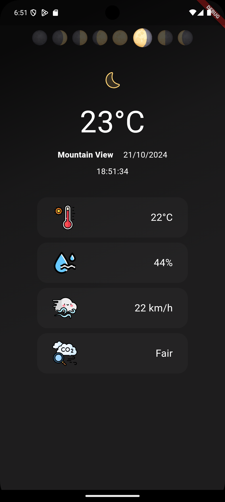

# Weathify

Weathify is a simple weather forecasting app developed in Flutter. The goal of Weathify is to provide up-to-date weather information in real-time for any location.

## Features

- Display of current weather forecast
- Detailed information such as temperature, humidity, and weather conditions
- Location search functionality
<br>

<br>

## Technologies Used

- **Flutter**: Framework for building mobile applications.
- **Dart**: Programming language used in Flutter.
- **MVC**: Model-View-Controller architecture for organizing the app.
- **Provider**: State management solution for managing app state.
- **l10n**: Localization support for multiple languages.
- **goRouter**: Navigation solution for routing within the app.
- **get_it**: Service locator for dependency injection.
- **OpenWeather API**: Integration with a open weather API to fetch meteorological data. Link: https://openweathermap.org/api (You should to create account and place your API key in repository)
- **Amplitude**:  is a product analytics platform that helps businesses understand user interactions with their digital products, providing insights to optimize user experience and inform product decisions.

## Prerequisites

Before running the project, ensure you have the following installed:

- [Flutter](https://flutter.dev/docs/get-started/install)
- An Android/iOS emulator or a physical device connected

## Cloning the Repository

To get a copy of the Weathify project on your local machine, follow these steps:

1. Clone the repository using Git:
   ```bash
   git clone https://github.com/KlayRodrigs/weathify-app-flutter
   cd weathify
   flutter pub get
   ```

## Configuration
API Key: You need to obtain an API key from OpenWeather. After creating an account, replace the placeholder in repository with your API key:

```
const String apiKey = 'YOUR_API_KEY';
```

## Running the App
To run the app on an emulator or connected device, use the following command:

```
flutter run
```

## Contributing
Contributions are welcome! If you want to contribute to Weathify, please fork the repository and submit a pull request.

## License
This project is licensed under the MIT License - see the LICENSE file for details.

## The current project is in version 1.0